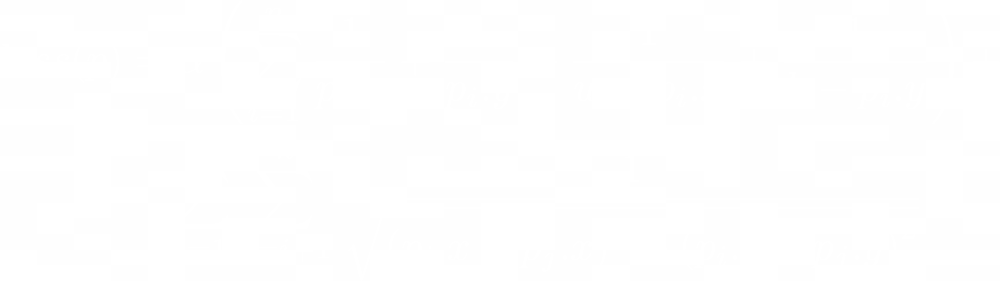
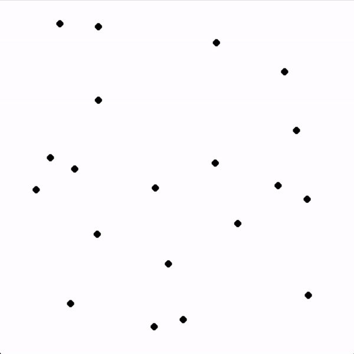

# Point Packing
## 📝 Description
In this project i use gradient descent to find the optimal 'packing' of points confined to a rectangular 2D container. I define this optimal packing as maximizing the sum of the pairwise distances and the distances to the borders for all points. On the basis of this definition i formulate the following loss function[^1] (Sorry to light theme users 😊): 

[^1]: I am aware that the loss function does not 100% match my definition. It does however give me a good way to formulate the problem. 

Here **p** is some list of points of length **n**. Each point stores its **x** and **y** position. The width and height of the rectangle are denoted by **w** and **h**. The first summation describes the loss attributed by the proximity of points to the borders. As a result, the constant **α** is a hyperparameter that controls the strength of the borders influence. The second term describes the loss attributed by the points lying close to each other (hence the summation over all possible pairs). This function is only well defined if none of the points overlap with each other or with the borders. It is also not well behaved if any of the points lie outside of the rectangle.

## 🔍 Example
Below you can see the (locally) optimal packing with **n=20**, **α=1** and **w=h=600**:

Or a packing with **n=1000**, **α=250** and **w=h=800**:

It is visually intuitive how **α** corresponds to the amount 'repulsion' the borders enforce on the points.
In the second gif you also see repulsion from mouse click. This is implemented by treating the mouse coordinate as any other point, except you add a weight to its contribution to the loss function. The magnitude of the weight then controles the strength of the repulsion.

## 🏗 Implementation
In order to optimize the defined loss function, you simply update the point positions using the gradient. This computation is done in C with OpenMP for parallelization. The visualization is done in Python with PyGame.

## 🏄‍♂️ Usage
To use the project run `
python3 draw.py`. Try clicking and dragging the mouse for repulsion. Press **R** to reset the points. You can try different setups by changing the settings in **points.py**.

